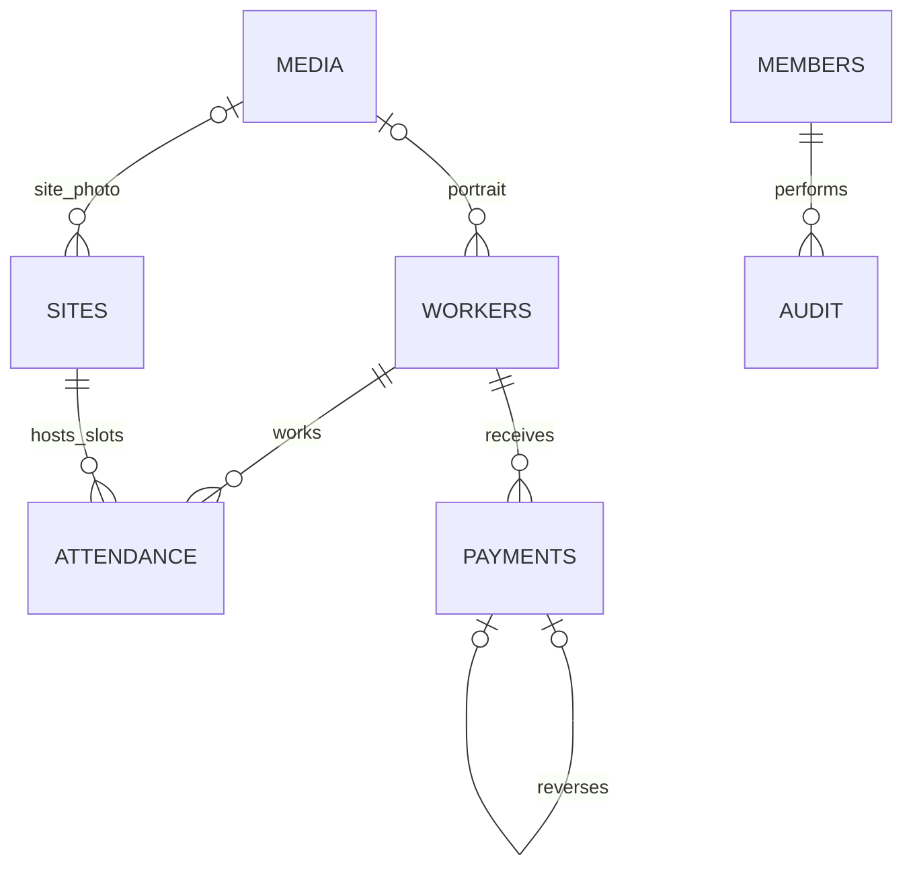
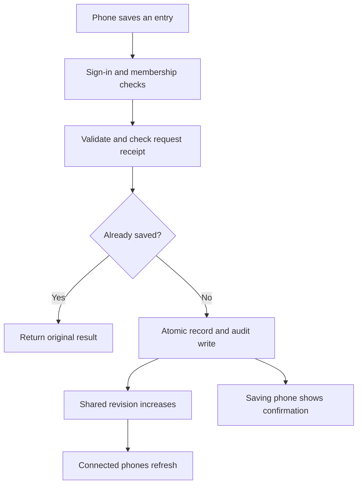

# Site Saathi: architecture and build guide

A connected first version for a contractor with four construction sites and roughly 40–50 workers. The working app supports the core day-to-day workflow. It is a private pilot, with the controls needed to start testing it safely with your brother before replacing the paper records.

## 1. What is built

| Requirement | This version |
| --- | --- |
| Worker profile | Photo upload, name, optional phone, daily wage, opening balance and archive status |
| Sites | Name, owner, address, photo, recognizable color, site number and archive status |
| Attendance | Full day, morning half, afternoon half, two sites in a day, or absent |
| Payments at any time | Record wages or advances, cash/UPI/bank method, business date and optional note |
| Automatic balance | Opening balance + wages earned − all money given + reversed entries |
| Worker history | Attendance, locations, payments, advances, reversals, balance and CSV export |
| Site costs | Date-range labour cost and worker-day totals, CSV export |
| Outstanding balances | All-time positive balances; advances remaining are shown separately |
| Dashboard | Today’s unique workers, unmarked workers, active sites, unpaid balances and recent payments |
| Father’s view | Large photos, familiar icons, large numeric choices, keypad, voice button and payment review |
| Brother’s view | Search, setup forms, reports, corrections and family administration |
| Persistence | SQL database for records and private object storage for uploaded photos |
| Live updates | Server-sent change notifications checked every three seconds while connected; a 30-second fallback refresh |
| Android use | Responsive web app, install manifest, app icons and home-screen installation support |
| Security | Sign-in, server-side member allowlist, administrator/operator roles, input validation and write-origin checks |
| Financial integrity | Integer money, saved wage snapshots, one worker-day record, transaction receipts and immutable payment reversals |

The app records money you have already given. It does not send UPI transfers, debit a bank account, calculate tax or issue statutory payroll documents. Site costs currently mean earned labour cost, rather than materials, invoices or profit.

## 2. Recommended stack for this first deployment

Build one installable web app first so both Android phones use the same code and database. Your brother can also manage it on a computer.

| Layer | Choice | Why it fits |
| --- | --- | --- |
| Interface | React + TypeScript | Shared types and one responsive interface for phones and desktop |
| Application framework | Vinext and Vite, from the supported Sites starter | Server routes and React rendering within the available deployment environment |
| UI primitives | Shadcn / Radix, Lucide icons | Accessible dialogs, sheets, tabs, switches and recognizable icons |
| Server | Cloudflare Workers | Authenticated APIs close to the hosted app |
| Database | Cloudflare D1, SQLite, Drizzle migrations | Relational records, uniqueness constraints and atomic database batches |
| Photos | Cloudflare R2 | Photos stored separately from payroll rows; served only after authorization |
| Live transport | Server-sent events | Both clients refresh when a committed operation advances the shared revision |
| Identity | Hosting platform sign-in + application member allowlist | No passwords to store; every write checks the user’s family role |
| Voice | Browser speech synthesis | Spoken names and amounts using a phone-installed voice |
| Android installation | Web manifest and service worker | Home-screen entry; offline notice without caching private payroll data |

Android installation varies by browser and phone. Chrome is the first target. See the [web.dev installation guide](https://web.dev/learn/pwa/installation). D1 documents that a failed statement in a batch rolls back the transaction in its [database API reference](https://developers.cloudflare.com/d1/worker-api/d1-database/). The server uses the browser’s standard [server-sent events model](https://developer.mozilla.org/en-US/docs/Web/API/Server-sent_events).

The dependency lockfile is retained. This is a practical first stack within the hosting environment, rather than a claim that any one framework is universally best. A native Android client can later use the same accounting model if offline use or phone-specific capabilities justify it.

## 3. The accounting rules

1. Store rupees as integer paise. ₹900 is `90000`. Payments allow two decimal places; daily wages in this version are whole rupees.
2. One date has two attendance slots: morning and afternoon. Each slot can belong to one site or be absent. Two populated slots constitute one workday; the same worker cannot acquire a third paid slot.
3. An unmarked day has no attendance row. An explicit absence has a row with both sites null. This distinguishes “not checked” from “did not attend”.
4. Each populated half-day saves its earned amount at the time it is recorded. Moving an already recorded slot to another site keeps its saved amount. Editing a worker’s current wage does not recalculate existing attendance.
5. When creating previously unrecorded attendance, the current daily wage supplies the new snapshot. Effective-dated wage history is a later iteration; a missed historical day entered after a wage change needs an agreed correction process before real rollout.
6. Both wage payments and advances mean money was handed to the worker. Both reduce the balance once. The `kind` is a useful label, not an extra deduction rule.
7. Positive balance means money still owed to the worker. Negative balance means an advance remains. The dashboard adds positive balances separately so one worker’s advance cannot hide another worker’s unpaid wages.
8. Initial paper balances belong in `opening_balance`. Positive means owed; negative means an advance. This amount is fixed after creation. Import a signed-off amount only once.
9. A wrong payment is reversed, with a reason. The original remains visible. A unique `reversal_of` prevents two reversals of the same entry.
10. There is no deletion endpoint for financial entries. Attendance corrections retain before/after data in the audit table.
11. India’s time zone defines the business day. A phone in another country must not accidentally record tomorrow’s attendance.
12. Operators can change today’s attendance and record today’s payments. Administrators can manage profiles, enter past dates, correct attendance and reverse payments. A reason is required for changing existing past attendance.

Example: Ramesh has no opening balance. He earns ₹900 each day for five full days and ₹450 for one half-day. Earned wages are ₹4,950. You gave him ₹1,000 in advance and later ₹2,000 in wages. His remaining balance is ₹1,950. The advance is already included in the ₹3,000 paid; it is not subtracted again.

If Ramesh spends a morning at Site A and an afternoon at Site B on a ₹900 day, each site receives ₹450 of labour cost. Overall headcount is one person; each site can truthfully report that the person worked there.

## 4. Data model

This deployment represents one family business. Every record also has a `demo` or `live` scope. A multi-contractor commercial service would need a separate organization ID and membership boundary on every relevant table.

| Table | Main fields | Constraints and purpose |
| --- | --- | --- |
| `settings` | id, owner_id, created_at | Singleton family ownership and one-time sample setup marker |
| `members` | email, user_id, name, role, active | Unique email and stable sign-in ID; admin/operator allowlist |
| `workers` | id, scope, name, phone, daily_wage, opening_balance, photo_key, sample_photo, active, version | Positive whole-rupee wage; media reference; versioned profile edits |
| `sites` | id, scope, name, owner, address, color, photo_key, active, version | Owner/address, photo, archive and version checks |
| `attendance` | id, scope, worker_id, date, am_site_id, pm_site_id, am_wage, pm_wage, version, last_operation, updated_by, updated_at | Unique worker/date; two slots; null slot must earn zero; populated slot must earn a positive amount |
| `payments` | id, scope, worker_id, amount, kind, date, method, notes, reversal_of, created_by, created_at | Positive integer amount; payment/advance/reversal kind; at most one reversal per original |
| `media` | id, scope, mime, bytes, created_by, created_at | Metadata for an R2 object; no blobs in SQL |
| `audit` | seq, id, scope, entity, entity_id, actor, payload_hash, payload, created_at | Unique idempotency ID, before/after evidence and global change revision |

The executable schema is in `db/schema.ts`. Generated, checked SQL is in `drizzle/`. The application never creates or alters tables during requests. Applied migrations must remain immutable; generate the next migration for a schema change.

The current state API returns the family’s complete records in one consistent database batch. This is easy to understand and adequate for a small pilot. Before importing years of paper records or growing materially beyond this team, replace it with server aggregate endpoints, date-bounded history and cursor pagination. Do not retain complete-history refreshes as the long-term mobile-data strategy.

## 5. How two phones stay consistent

Every logical write has a UUID. Retrying the same request with the same UUID returns the original success. Reusing that UUID for different data is rejected. The audit payload digest binds it to its original actor and data.

An attendance write carries the version last seen by the phone. An update only matches that version. If the other phone already saved a change, the API returns HTTP 409 instead of silently overwriting it. The app fetches the latest state so the user can review it.

D1 runs the record update and receipt insert in one transaction. The receipt is inserted only when the mutation changed exactly one row. If either statement fails, neither financial change nor receipt persists. Route tests exercise this with a real SQLite transaction adapter.

The event endpoint checks the audit revision every three seconds while the stream is connected. It periodically reconnects and checks membership. The interface accurately distinguishes live, connecting and offline states; a fallback refresh runs every 30 seconds. This is near-real-time synchronization, not an instantaneous push guarantee.

## 6. User experience and wireframes

Open `docs/wireframes.svg` for three phone wireframes: photo home, attendance and payment confirmation. These are layout specifications, separate from the working app.

| Screen | Father’s main action | Brother’s extra controls |
| --- | --- | --- |
| Home | Three large actions: attendance, payment, balance | Dashboard, site headcounts and recent payments |
| Attendance | Select site photo/number → worker photo → 1 / ½ / 0 → large check | Pick date, correct a previous entry, split sites |
| Payment | Select worker photo → enter digits → hear amount → confirm photo and amount | Payment type, method, date and note |
| Worker | Recognize photo → see and hear the balance | Phone number, wage, opening balance, history, export and archive |
| Site | Recognize photo or site number | Owner/address, edits and labour report |

Avoid teaching him to read the app. Teach a small set of repeated actions: worker photo, site picture/number, green check, half-day symbol, rupee amount and speaker. Color reinforces the icon but never carries the only meaning. Financial amounts and action buttons are large; the app uses the same placement repeatedly.

The photo view is a device preference, not a security role. Switching views cannot grant administrator permissions. On a small phone it is selected automatically on the first visit; the setting is retained on that phone.

English, Telugu and Hindi voice options are included. Only the spoken core actions are localized; administrator forms remain English. The phone must have a suitable installed voice. The app reports when Telugu or Hindi speech is unavailable. Test the voice with your father rather than assuming synthetic pronunciation will be clear.

Worker photos are required when adding real workers. Site photos are encouraged. Synthetic sample portraits are visibly limited to the sample workspace. They are not real workers. Uploaded photos are resized on the device before upload; only JPEG/PNG images are accepted by the server, with a 5 MiB limit. Names are not inferred from photos.

## 7. Implementation sequence

1. **Set the core rules.** Establish the business date, paise units, two-slot attendance, advance treatment and sign-off opening balances.
2. **Create the schema and migrations.** Add foreign keys, worker/date uniqueness, reversal uniqueness and indexes for scope/date/worker queries.
3. **Put authorization on the server.** Read trusted identity, look up membership and enforce administrator/operator actions on every endpoint.
4. **Add the read model.** Retrieve workers, sites, attendance, payments and the shared revision together; surface unavailable states without inventing data.
5. **Implement atomic writes.** Validate requests, check scope and referenced records, require versions, and commit audit receipts in the same transaction.
6. **Add photos.** Keep uploads in R2, metadata in D1, and all reads behind membership checks.
7. **Build the primary phone flows.** Worker recognition, site recognition, attendance, a numeric keypad, and a separate payment review step.
8. **Add management screens.** Reports, history, exports, archive controls and administrator setup.
9. **Add synchronization.** Receive revision events, refresh committed data and retain visible form entries when saving fails.
10. **Verify integrity.** Exercise API routes with SQL constraints, failed transactions, retries, concurrent versions and role changes.
11. **Build and privately publish.** Save the exact source and its migration/build artifacts; keep the first deployment restricted to the owner for review.
12. **Roll out to the two phones.** Add approved family accounts, complete access configuration, test Android sign-in and speech, and reconcile sample entries before importing real balances.

## 8. Validation performed

The initial verification suite has 18 checks, all passing:

- Anonymous and nonmember payroll access are rejected.
- Setup is complete and repeatable; real records start empty.
- Payment retries are idempotent; mismatched request reuse is rejected.
- Stale attendance cannot overwrite another phone’s change or create a false receipt.
- A worker cannot have two independent paid day records.
- An invalid version on an unmarked day cannot create a false absence.
- Sample and real sites cannot be mixed in attendance.
- A reversal keeps the original, restores its exact amount and cannot be duplicated.
- An operator can record today but cannot administer profiles or backdate payments.
- Invalid money, future dates and cross-origin writes are rejected.
- Revoking a family member removes API access.
- A failed SQL statement rolls back the record and receipt together.
- Balance math handles opening balances, advances, payments and reversals.
- An advance larger than earnings produces a separate negative balance.
- Wage snapshots remain unchanged when a populated slot is moved.
- Site allocations conserve total earned wages across a split day.
- The business date changes at India midnight.
- CSV text neutralizes formula injection.

The suite uses the real route code and generated schema with an in-memory SQLite adapter. Identity and R2 are test doubles. Type checking and the production build are separate checks. These checks do not prove Android usability, hosting identity behavior, browser streaming, real R2 round trips or two-device synchronization. Those are the next acceptance checks with the family’s actual phones; browser/device QA was not performed in this build.

## 9. First family setup

1. Open the private app under your owner account. Try the sample workspace.
2. Have your brother mark a half-day, split a day between two sites, record an advance and reverse a mistaken payment. Check the resulting balances.
3. Choose **My real records**. The sample people and payments do not carry over.
4. Add the four sites, with photographs and familiar names.
5. Add each worker’s actual photo, agreed wage and signed-off opening balance. If the old records are unclear, resolve them before entering them as fact.
6. Add the family members’ exact sign-in emails and their roles. The hosting access policy must also permit those people; the application allowlist alone cannot grant access through an owner-private Site. External visitor availability depends on the workspace’s sharing support.
7. On each Android phone, open the app in Chrome and add it to the home screen. Keep both devices on the same real workspace.
8. Turn on Photo view for your father. Select and test his spoken language. Let him make the taps himself while your brother watches.
9. Verify that a saved entry appears on the other phone within a few seconds. Also test reconnecting, a duplicate tap and two phones changing the same attendance day.
10. Run the app and paper records together for several workdays. Reconcile wages and cash daily. Then decide when to make the app the primary record.

No invitations have been sent and no actual family email addresses have been added. The current publish is private to the owner.

## 10. Next iterations, in order

| Iteration | Deliverable | Exit check |
| --- | --- | --- |
| 2: Family field trial | Family access, real-device voice and photo adjustments, business-rule decisions | Father completes attendance and one payment unaided; two phones reconcile |
| 3: Wage and history growth | Effective-dated wage rates, paginated histories, server-side report totals, explicit corrections to imported opening balances | Old-day calculations stay correct after wage changes; large histories do not make every refresh expensive |
| 4: Weak connectivity | Durable local draft/outbox, explicit pending state, same operation ID through app restarts, conflict review | Offline records survive restart and sync exactly once when reconnected |
| 5: Operational readiness | Tested backup/restore process, retention and photo cleanup, monitoring, endpoint rate limits, audit viewer and finalized date locks | Restore drill reproduces balances and photos; errors are observable |
| 6: Business expansion | Material expenses, owner billing, receipts, overtime/role-specific rates or a native client as needed | Each new amount reconciles against the existing ledger |

Do not promise offline saves in the current version: it deliberately waits for server confirmation. A network failure can leave the user unsure whether a request reached the server; retrying the unchanged open form reuses its ID. Durable recovery across closing or restarting the app belongs in the offline iteration.

The first version is usable for a controlled pilot and has production-minded integrity controls. A live payroll rollout should follow the family phone checks and restore exercise, rather than treating a passing code build as a production certification.
